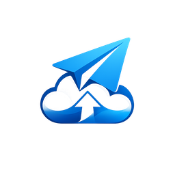

<div align="center">
  

  <h1 align="center">Telegram Drive</h1>
  <p align="center">
    <strong>A high-performance, zero-knowledge virtual filesystem powered by Telegram.</strong>
  </p>

  <p align="center">
    <a href="https://github.com/nfsprogramming/Telegram-Drive/releases"></a>
    <a href="https://github.com/nfsprogramming/Telegram-Drive/stargazers"></a>
    <a href="https://github.com/nfsprogramming/Telegram-Drive/blob/main/LICENSE"></a>
    
    
  </p>
</div>

<hr />

## Table of Contents
- [Overview](#overview)
- [How It Works](#how-it-works)
- [Key Features Deep-Dive](#key-features-deep-dive)
- [Security & Privacy](#security--privacy)
- [Technical Stack](#technical-stack)
- [Installation Guide](#installation-guide)
- [Configuration & API Setup](#configuration--api-setup)
- [Roadmap](#roadmap)
- [Contributing](#contributing)
- [License & Organization](#license--organization)

---

## Overview

**Telegram Drive** is an open-source, enterprise-grade desktop application that mounts Telegram's global CDN infrastructure as an unlimited, highly secure virtual drive. Built entirely in Rust and React, it bypasses traditional cloud storage limitations by leveraging the Telegram MTProto API.

Instead of paying monthly subscription fees for cloud storage, Telegram Drive allows you to securely utilize the infrastructure you already have access to.

---

## How It Works

Telegram Drive does not rely on third-party backend servers. The entire architecture is peer-to-cloud:

1. **Local Authentication:** You log in using your standard Telegram credentials via the MTProto protocol. Your authentication keys are stored securely in your OS keychain.
2. **Channel Mapping:** The application creates private Telegram Channels in your account to act as "Folders".
3. **File Chunking:** Large files are split into manageable 2GB binary chunks.
4. **Direct Upload/Download:** The Rust backend communicates directly with Telegram's datacenters to stream chunks up and down, maxing out your bandwidth limits.
5. **Virtual Filesystem:** The React frontend interprets these private channels and messages as a standard filesystem UI, complete with drag-and-drop mechanics.

---

## Key Features Deep-Dive

*   **Infinite Capacity:** Bypass local storage constraints. Telegram offers unthrottled, unlimited storage for "Saved Messages" and private channels.
*   **High-Throughput Grid:** A custom virtual scrolling implementation capable of rendering directories with over 100,000 files with zero frame drops or memory leaks.
*   **Media Streaming Engine:** Direct chunked-streaming of video and audio binaries. You can play a 4GB `.mkv` file instantly without waiting for the initial download sequence to finish.
*   **Intelligent Deduplication:** Prevents uploading the same file twice by comparing file hashes locally before transmitting payloads to the network.
*   **Resilient Connections:** Automatic retries for network drops, ensuring large multi-gigabyte uploads complete successfully even on unstable Wi-Fi.
*   **Cross-Platform Architecture:** Available as a desktop application (Windows/Linux) and a native mobile application (Android APK) built from the exact same Rust core.
*   **Encrypted Vaults:** Create password-protected encrypted folders (Vaults) that automatically lock themselves to secure your most sensitive files.
*   **Deep Link Sharing:** Share files seamlessly across devices with native `tgdrive://` deep links.
*   **Multi-Account Support:** Hot-swap between multiple Telegram accounts without needing to re-authenticate or clear caches.
*   **Premium Glassmorphism UI:** Hardware-accelerated frosted glass interfaces with specialized dark and light themes.

---

## Security & Privacy

We treat security as a first-class citizen. Telegram Drive is designed around a **Zero-Knowledge Architecture**.

*   **No Middleware Servers:** Your data never touches our servers. The application communicates directly between your local machine and Telegram's API endpoints.
*   **Client-Side Execution:** All API keys, session tokens, and passwords are encrypted and stay on your local storage.
*   **Encrypted Vaults:** Optional Vault folders encrypt your data locally with a password before it is ever uploaded, ensuring no one (not even Telegram) can read the contents without your vault password.
*   **Private Channels:** Standard files are uploaded exclusively to private channels where you are the sole member.

---

## Technical Stack

| Layer | Technology | Purpose |
|-------|------------|---------|
| **Core Runtime** | `Rust` / `Tauri` | High-performance system integration, binary execution, and filesystem access |
| **Network** | `Grammers` | Native MTProto asynchronous Telegram client implementation |
| **Frontend** | `React 18` / `TypeScript` | Type-safe, component-driven user interface |
| **Styling** | `TailwindCSS` | Utility-first styling with custom CSS variables |
| **State Mgmt** | `Zustand` | Lightweight, unopinionated state management |

---

## Installation Guide

### System Requirements

*   **Node.js**: v18.0.0 or higher
*   **Rust Toolchain**: Latest stable build (`rustup`)
*   **C++ Build Tools**: Required for native binary compilation (e.g., Visual Studio Build Tools on Windows, Xcode CLI on macOS)

### Local Development Setup

1. **Clone the repository:**
   ```bash
   git clone https://github.com/nfsprogramming/Telegram-Drive.git
   cd Telegram-Drive
   ```

2. **Initialize dependencies:**
   ```bash
   cd app
   npm install
   ```

3. **Compile and Run:**
   ```bash
   # Launch development server with hot-reload
   npm run tauri dev
   
   # Compile production binaries (.exe, .dmg, .AppImage)
   npm run tauri build
   ```

---

## Configuration & API Setup

To run Telegram Drive locally, you must provide your own Telegram Developer API credentials. 

1. Navigate to [my.telegram.org](https://my.telegram.org) and log in.
2. Go to **API development tools**.
3. Create a new application (the name doesn't matter).
4. Copy the generated `api_id` and `api_hash`.
5. Upon launching Telegram Drive for the first time, you will be prompted to enter these credentials in the secure setup wizard.

---

## Roadmap

- [x] Initial MTProto integration and auth flow
- [x] Virtual filesystem UI with drag-and-drop
- [x] In-app media streaming (Video/Audio)
- [x] End-to-End Vault Encryption layer
- [x] Multi-account state management
- [x] Android Mobile Compilation
- [x] Deep Link (tgdrive://) Support
- [ ] Native OS file explorer integration (FUSE/WinFSP)
- [ ] Offline file caching

---

## Contributing

We welcome contributions from the open-source community! 

1. Fork the Project
2. Create your Feature Branch (`git checkout -b feature/AmazingFeature`)
3. Commit your Changes (`git commit -m 'Add some AmazingFeature'`)
4. Push to the Branch (`git push origin feature/AmazingFeature`)
5. Open a Pull Request

Please ensure your code follows the existing formatting guidelines and passes `cargo clippy` and TypeScript compiler checks.

---

## License & Organization

Developed and maintained by **NFS Programming**. 

This project is distributed under the [MIT License](LICENSE).

> **Disclaimer:** This software is an independent, open-source project and is not affiliated, endorsed, or sponsored by Telegram FZ-LLC. Users must adhere to Telegram's Terms of Service regarding API usage limits.
